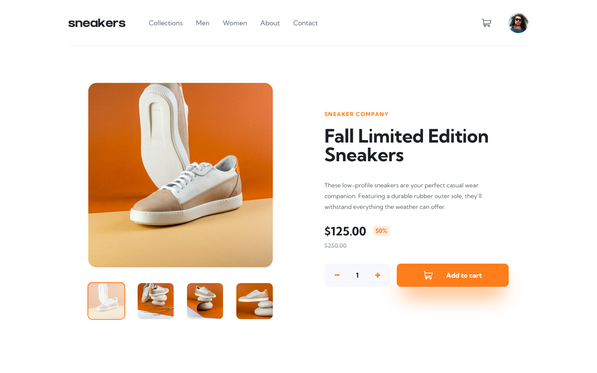
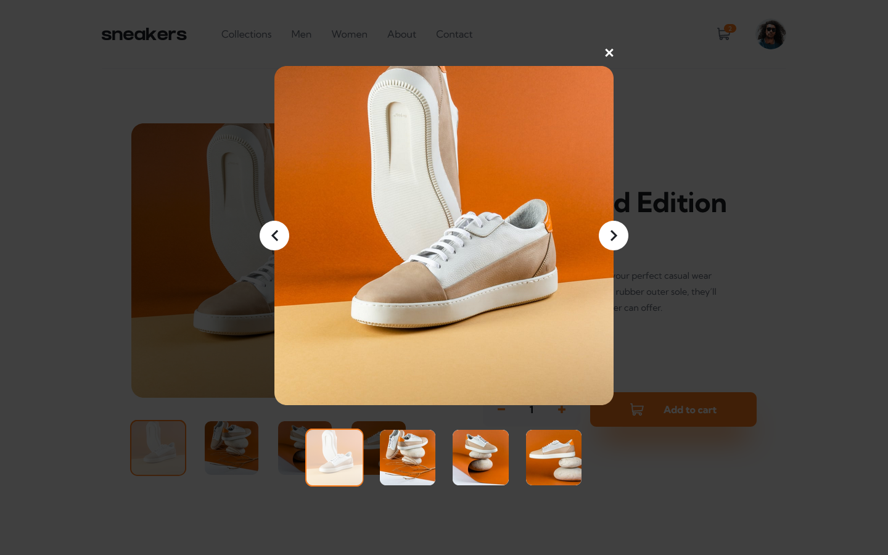
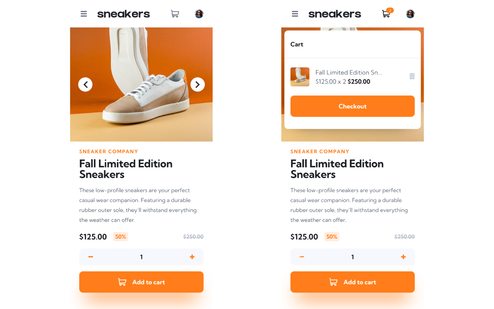

# Frontend Mentor - E-commerce product page solution

This is a solution to the [E-commerce product page challenge on Frontend Mentor](https://www.frontendmentor.io/challenges/ecommerce-product-page-UPsZ9MJp6). Frontend Mentor challenges help you improve your coding skills by building realistic projects.

## Table of contents

- [Overview](#overview)
  - [The challenge](#the-challenge)
  - [Screenshot](#screenshot)
  - [Links](#links)
- [My process](#my-process)
  - [Built with](#built-with)
  - [Useful resources](#useful-resources)
- [Author](#author)

## Overview

### The challenge

Users should be able to:

- View the optimal layout for the site depending on their device's screen size
- See hover states for all interactive elements on the page
- Open a lightbox gallery by clicking on the large product image
- Switch the large product image by clicking on the small thumbnail images
- Add items to the cart
- View the cart and remove items from it

### Screenshot

### Links

<!-- - Solution URL: [Add solution URL here](https://your-solution-url.com) -->

- Live Site URL: [e-commerce-product-page-rf.netlify.app/](https://e-commerce-product-page-rf.netlify.app/)

## My process

### Built with

- Semantic HTML5 markup
- CSS custom properties
- Flexbox
- CSS Grid
- Mobile-first workflow
- [SCSS](https://sass-lang.com) - CSS preprocessor
- [React](https://reactjs.org/) - JS library
- [A11y-dialog](https://a11y-dialog.netlify.app/) - Accessible dialogs
- [Typescript](https://www.typescriptlang.org/) - Strongly typed Javascript
- [Vite](https://vitejs.dev) - Frontend tooling

### Useful resources

- [How to enable React Strict Mode](https://kentcdodds.com/blog/react-strict-mode)  
  [New Strict Mode Behavious](https://reactjs.org/blog/2022/03/29/react-v18.html#new-strict-mode-behaviors) - These articles helped me learn about pure react reducer functions and understand why my code was getting run twice.

## Author

- Website - [Riccardo Fano](https://www.riccardofano.com)
- Frontend Mentor - [@riccardofano](https://www.frontendmentor.io/profile/riccardofano)
